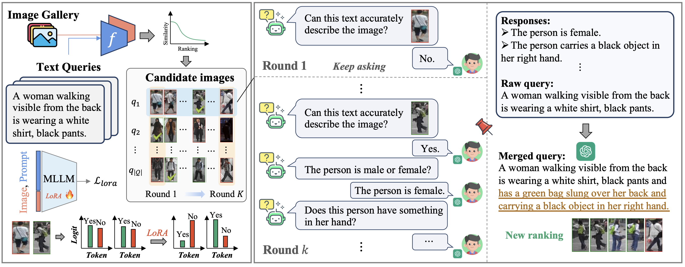
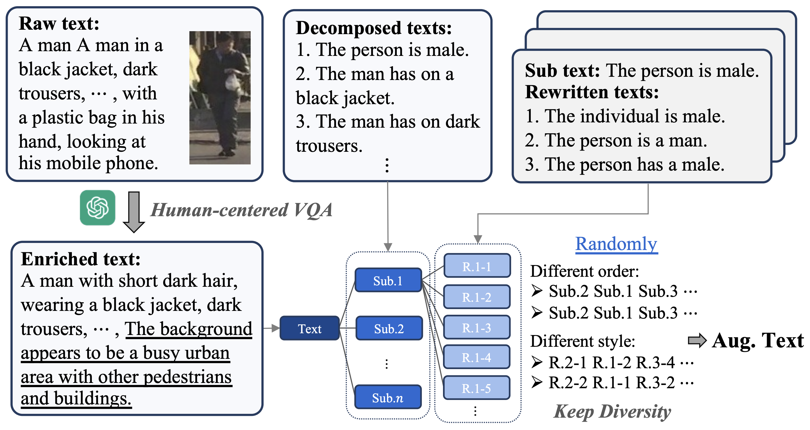
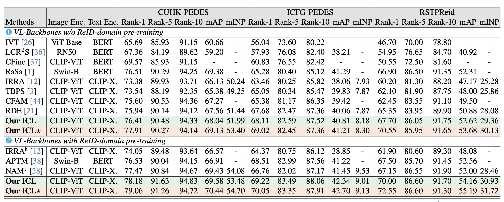

## Introduction
PyTorch implementation for [Human-centered Interactive Learning via MLLMs for Text-to-Image Person Re-identification](https://openaccess.thecvf.com/content/CVPR2025/papers/Qin_Human-centered_Interactive_Learning_via_MLLMs_for_Text-to-Image_Person_Re-identification_CVPR_2025_paper.pdf) (CVPR 2025). 

[Supplementary Material](https://openaccess.thecvf.com/content/CVPR2025/supplemental/Qin_Human-centered_Interactive_Learning_CVPR_2025_supplemental.pdf)

## New!
- We will release the RDA pre-trained model weights and training logs. Come soon!
<!-- - We will release code of ICL. Come soon! -->
<!-- - 2025/6/9, we released the code of ICL. -->

## Requirements and Datasets
- [LLaMA-Factory](https://github.com/hiyouga/LLaMA-Factory/)
- [vllm](https://github.com/vllm-project/vllm)
- qwen_vl_utils
- [CUHK-PEDES, ICFG-PEDES, RSTPReid,](https://github.com/anosorae/IRRA/) [UFine6926](https://github.com/Zplusdragon/UFineBench/)
- Others as [RDE](https://github.com/QinYang79/RDE)
> conda create --name myenv python=3.10\
> pip install vllm,easydict,ftfy,prettytable,nltk,qwen_vl_utils

## THI Framework
The illustration of our Test-time Human-centered Interaction (THI) module. THI includes $K$ rounds of interactions to align query intention with the latent target image by external guidance, where in each round, we perform human-centered visual question answering around fine-grained person attributes to enhance the semantic consistency between the query and the intended person image, and then improve the final ReID performance on the large-scale evaluation through efficient re-ranking. Besides, we perform supervised fine-tuning via LoRA to inspire the discriminative ability of MLLM for ReID domain images and better align queries with latent target images.


## Reorganization Data Augmentation
The illustration of our RDA. The purpose of RDA is to supplement more details to the original training texts through human-centered VQA, improving the discriminability of texts. In addition, to enhance diversity, RDA maximizes diversity through the Decomposition-Rewriting-Reorganization strategy.
<p align="center">

</p>

For all augmentation data, see [RDA_data.zip](./RDA_data.zip)

## Training and Evaluation

### Training new models via RDA

Modify the  ```self.anno_path``` in the ```datasets/cuhkpedes.py,icfgpedes.py, rstpreid.py, ufine.py```. You have to replace the path to the json file in RDE_data.

```
sh run_rde.sh
```

If you use pre-trained parameters to initialize CLIP you must '+pre' in args.loss_names and modify the relevant path variables in main.

If you use pre-trained parameters to initialize CLIP you must use '+pre' in args.loss_names and modify the relevant the path variable ```model_pre``` in ```main.py```. In our experiments, we use pre-trained parameters from [MLLM4Text-ReID](https://github.com/WentaoTan/MLLM4Text-ReID).
```
sh run_rde.sh
```

### Evaluation
Modify the  ```sub``` in the ```test.py``` file and run it.
```
python test.py
```

### Running THI
You first need to download the weights of [Qwen2VL-7B-Instruct](https://huggingface.co/Qwen/Qwen2-VL-7B-Instruct) and use [LLaMA-Factory](https://github.com/hiyouga/LLaMA-Factory/) to merge the [LoRA parameters](https://huggingface.co/Yangsss/ICL/blob/main/lora.tar.gz). The relevant files are already provided [here](https://huggingface.co/Yangsss/ICL).
```
sh run_vllm_ICL.sh
```
 

### Experiment Results:



## Citation
If RDE is useful for your research, you can cite the following papers:
```
@inproceedings{qin2024noisy,
  title={Noisy-Correspondence Learning for Text-to-Image Person Re-identification},
  author={Qin, Yang and Chen, Yingke and Peng, Dezhong and Peng, Xi and Zhou, Joey Tianyi and Hu, Peng},
  booktitle={IEEE International Conference on Computer Vision and Pattern Recognition (CVPR)},
  year={2024},
}
```

```
@inproceedings{qin2025human,
  title={Human-centered Interactive Learning via MLLMs for Text-to-Image Person Re-identification},
  author={Qin, Yang and Chen, Chao and Fu, Zhihang and Peng, Dezhong and Peng, Xi and Hu, Peng},
  booktitle={Proceedings of the Computer Vision and Pattern Recognition Conference},
  pages={14390--14399},
  year={2025}
}
```

## License

[Apache License 2.0](http://www.apache.org/licenses/LICENSE-2.0)

## Acknowledgements
The code is based on [RDE](https://github.com/QinYang79/RDE) licensed under Apache 2.0.
